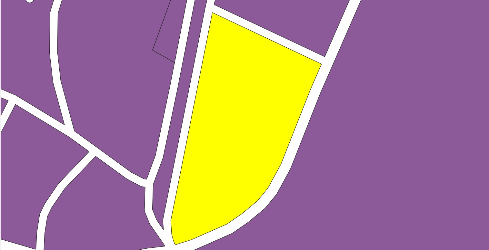
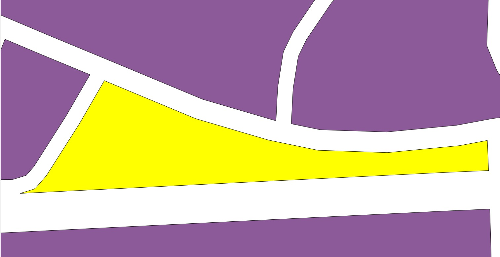
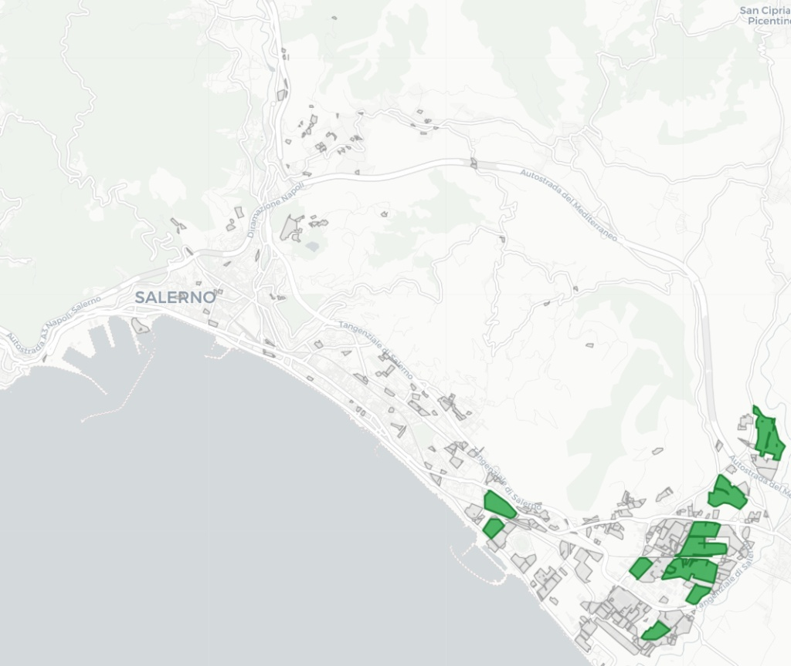
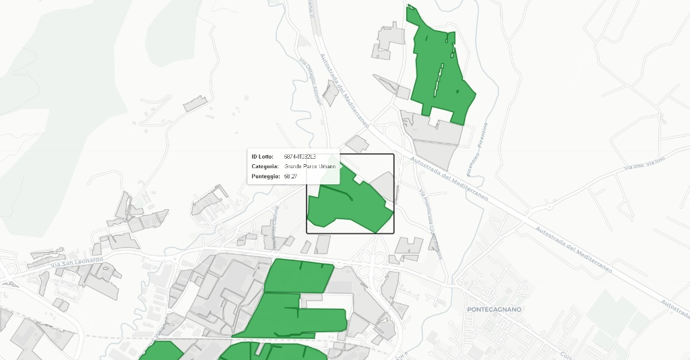
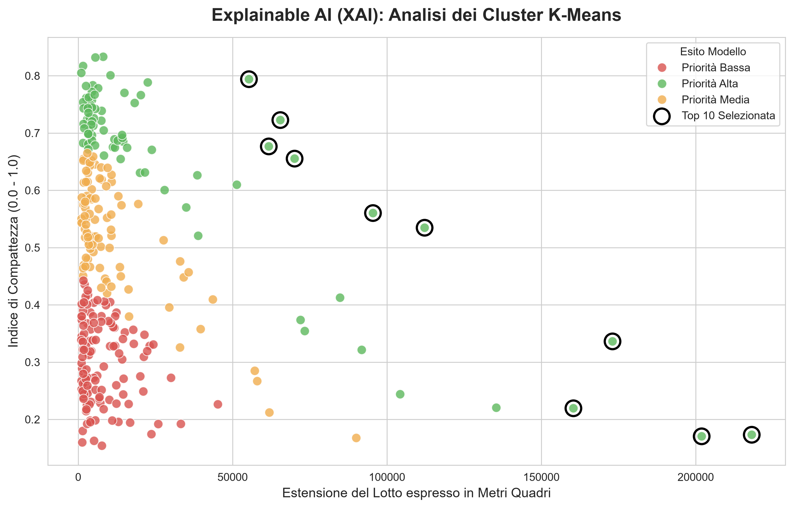

# 🌿 GreenZone Finder: AI-Driven Spatial Decision Support System

Questo repository contiene l'implementazione di un Sistema di Supporto alle Decisioni Spaziali (SDSS) per l'individuazione di aree industriali dismesse idonee alla riconversione in parchi pubblici nella città di Salerno.

Il progetto unisce l'analisi geospaziale (GIS) con tecniche di Intelligenza Artificiale, seguendo le *best practice* di Software Engineering.

## 🎯 Obiettivi e Requisiti di Dominio
Il sistema valuta l'idoneità delle aree basandosi su una serie di vincoli normativi, morfologici e urbani.

**1. Requisiti Escludenti (Hard Constraints) - Implementati via GeoProcessing:**
* Pendenza del terreno: Esclusione delle aree non pianeggianti (basato su DTM).
* Vincolo Idrogeologico (Legge Galasso): Buffer di esclusione di 150 metri dal reticolo idrografico.
* Vincolo di Sicurezza: Buffer di esclusione di 30 metri dalla rete ferroviaria.
* Dimensione del lotto: Esclusione di aree con superficie minore di 1000 metri quadri (scartati i *pocket parks* non rilevanti per grandi riqualificazioni).

**2. Requisiti Premianti (Features del Modello AI):**
* **Indice di Compattezza (Polsby-Popper):** Per penalizzare aree lunghe e strette (es. vecchi corridoi stradali) a favore di geometrie circolari/quadrate ottimali per un parco. 
* Vicinanza ad aree ad alta densità abitativa (Dati ISTAT).
* Distanza dai parchi già esistenti (per massimizzare la copertura del verde urbano).

## 🗺️ Metodologia e Workflow GeoSpaziale (QGIS)
La prima fase del progetto ha riguardato l'estrazione e la pulizia dei dati vettoriali tramite il **Modellatore Grafico di QGIS**.

1. **Intersezione Morfologica:** Il layer Copernicus Urban Atlas è stato ritagliato sulle sole aree pianeggianti di Salerno.
2. **Sottrazione a Cascata (Difference):** Sono stati sottratti geometricamente i buffer fluviali, ferroviari e i parchi esistenti.
3. **Selezione Tematica e Feature Engineering Spaziale:** Sono stati isolati i codici Copernicus *12100* (Aree Industriali) e *13400* (Aree Dismesse). Successivamente, tramite calcolatore di campi, sono state estratte le coordinate del baricentro (Centroid X/Y) e calcolati Area reale e Perimetro per la successiva analisi in Python.

Il risultato di questa pipeline è il dataset validato e consolidato: `dataset_parchi_salerno.geojson`.

## 🧠 Architettura del Sistema MLOps & Analisi Dati
L'infrastruttura segue il paradigma MLOps per garantire riproducibilità, tracciamento e deployment continuo. Di seguito le fasi di sviluppo implementate:

### 1. Data Engineering (GeoPandas) e Sanity Check
Ingestione del GeoJSON esportato da QGIS. È stato calcolato l'**Indice di Compattezza** per eliminare automaticamente i falsi positivi (artefatti geometrici residui), garantendo che la macchina valuti solo lotti urbanisticamente validi.

| Geometria Idonea (Score: 0.67) | Artefatto/Corridoio (Score: 0.25) |
| :---: | :---: |
|  |  |
| *ID: 5841 - Forma Compatta, Mantenuta.* | *ID: 5821 - Forma Allungata/Irregolare, Scartata.* |

### 2. Machine Learning: Motore Ibrido (MCDA + K-Means)
Per classificare l'idoneità delle aree rimanenti, è stato sviluppato un approccio che unisce logica di dominio e Machine Learning non supervisionato:
* **Scoring MCDA:** Calcolo di un *Suitability Score* normalizzato (60% Area, 40% Compattezza).
* **Clustering K-Means (Scikit-Learn):** Raggruppamento algoritmico dei lotti in 3 cluster naturali di priorità (Alta, Media, Bassa), rimuovendo i bias decisionali umani e permettendo l'estrazione della **Top 10 assoluta**.

### 3. Visualizzazione WEBGIS (Folium)
Riproiezione dei dati spaziali (WGS84) e creazione di una mappa interattiva per la fruizione dei risultati da parte dei decisori.

| Panoramica Lotti Classificati | Dettaglio Top 10 e Pop-up Interattivi |
| :--: | :--: |
|  |  |

*(I lotti in verde rappresentano la fascia di Alta Priorità generata dall'IA).*


### 4. **Explainable AI (XAI):** 
Per rispettare i principi di tracciabilità dell'Intelligenza Artificiale, il modello fornisce un output visivo che spiega la classificazione dei cluster, evitando l'effetto *Black Box* e rendendo interpretabile il processo decisionale della macchina.
Lo Scatter Plot evidenzia come la distribuzione asimmetrica positiva delle aree (Right-Skewed) abbia permesso all'algoritmo di premiare i rarissimi lotti con estensione e compattezza ottimali (Top 10).



### 5. **Deployment (FastAPI):** 
L'intero motore logico è stato pacchettizzato ed esposto come microservizio RESTful. Questo permette a client esterni (es. applicativi Web o plugin QGIS) di interrogare il modello in tempo reale inviando i dati di un lotto e ottenendo il  *Suitability Score* calcolato.

## 💻 Tecnologie Utilizzate
* **GIS:** QGIS (Modellatore Grafico, Geoprocessing)
* **Data Processing:** Python, GeoPandas, Shapely
* **Machine Learning:** Scikit-Learn / XGBoost, SHAP (per XAI)
* **MLOps:** MLflow, DVC
* **Backend:** FastAPI, Uvicorn

## ⚙️ Setup dell'ambiente Locale

Per riprodurre il progetto in locale sul proprio computer, seguire i seguenti passaggi:

1. **Clonare il repository:**
```bash 
git clone https://github.com/EDAURIA12/GreenZone.git
cd GreenZone
```

2. **Creare un ambiente virtuale Python:**
```bash
python -m venv .venv
```
3. **Attivare l'ambiente virtuale:**
* Su Windows: `.venv\Scripts\activate`
* Su MacOS/Linux: `source .venv/bin/activate`

4. **Installare le dipendenze necessarie:**
```bash
pip install -r requirements.txt
```